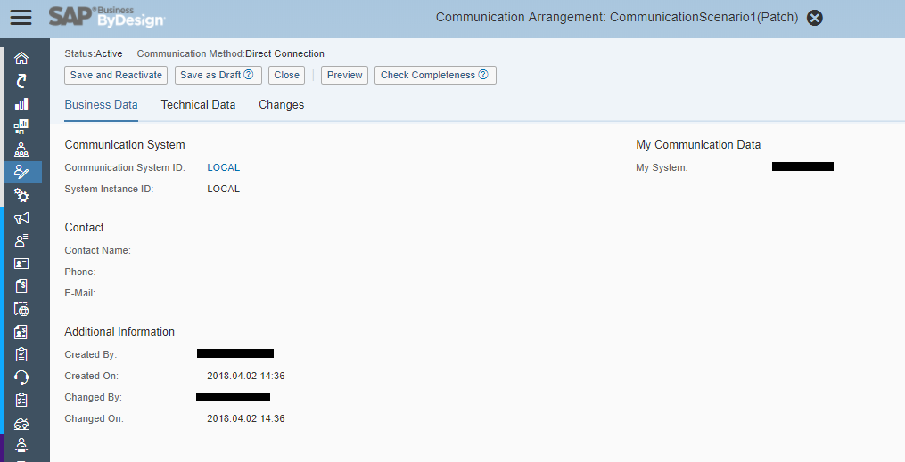

# Flow Instruction

In this case, I'm going to send requests to "Web Service" which is on the same ByDesign Tenent.


#### Here is my scenario.
I need to implement an interface that receive and save logging data of production confirmations from third-party system, and post production confirmations on my tenent by using those logs.
- [x] receive & save
- [x] post **Production Confirmations** via External Web Service Integration

# Steps of implementation
- Custom Inbound Service
  1. [Create custom Business Object](#cbo)
  1. [Create Service Integration](#si)
  1. [Create `.absl` for AfterModify Event of Root node of Business Object](#bo_aftermodify)
  1. [Create Communication System and Arrangement](#comm_sys_arr)
- Custom Outbound Service
  1. [Create "External Web Service Integration" item in Solution Explorer](#ewsi)
  1. [Create **Communication Arrangement** using "Communication Scenario"](#comm_arr)

## Custom Inbound Service

### <a name="cbo"></a> Create custom Business Object.

  ```javascript
  import AP.Common.GDT as apCommonGDT;

  businessobject ProductionConfirmation {
    // Root node must not be specified, it is created implicitly
    //
    // Add elements here.
    //
    // To declare an element as alternative key, use the [AlternativeKey] annotation.
    // Please note:
    // - An alternative key of type UUID exists implicitly for each node, enabling the node
    //   to be used as an association target.
    // - The QueryByElements query is created automatically for each node.
    // - Code completion is available with CTRL + SPACE.

    element OrderID : BusinessTransactionDocumentID ;
    element TaskID : BusinessTransactionDocumentID ;
    element Message : LANGUAGEINDEPENDENT_LONG_Note ;
  }
  ```

### <a name="si"></a> Create Service Integration

- Right-Click `.bo` item, click **Create Service Integration** menu.

#### Wizard initial

- Select **Web Service**.

#### Wizard 1


#### Wizard 2~8
- I think here is no doubt for this wizard. Wish you luck.
- Just follow the wizard, create **Create**, **Update**, **Read**, **QueryByElements** operations, and a **Communication Scenario**.

#### Wizard 9
- review and finish

#### After finish Wizard
- Activate all created items
- Create **Communication System** if nothing can use
- Create **Communication Arrangement** by **Communication Scenario**

### <a name="comm_sys_arr"></a> Create Communication System and Arrangement

#### Communication System - local


#### Communication Arrangement





### Create `.absl` for AfterModify Event of Root node of Business Object
- It's used for handling request and response of **Custom Outbound Service**

```javascript
/*
	Add your SAP Business ByDesign scripting language implementation for:
		Business Object: ProductionConfirmation
		Node: Root
		Event: AfterModify

	Note:
	  - To access the elements of the business object node,
	    use path expressions, for example, this.<element name>.
	  - To use code completion, press CTRL+J.
	  - The solution uses this script if:
		- the value of any field in the node in which this script is contained is modified.
		- the node itself is modified by another business object within the same solution.
*/
import ABSL;
import AP.LogisticsExecution.Global;

var qryLot;
var paramLot;
var resultLot;

qryLot = ProductionLot.QueryByElements;
paramLot = qryLot.CreateSelectionParams();
paramLot.Add(qryLot.ProductionOrderID.content,"I","EQ",this.OrderID.content);
resultLot = qryLot.Execute(paramLot);

var Req_LotsIn : EWS2.MaintainBundle_V1.Request;
var ReqItem_ProdLot : EWS2.MaintainBundle_V1.Request.ProductionLotsBundleMaintainRequest_sync_V1.ProductionLot;
var ReqItem_ConfGroup : EWS2.MaintainBundle_V1.Request.ProductionLotsBundleMaintainRequest_sync_V1.ProductionLot.ConfirmationGroup;
var ReqItem_ProdTask : EWS2.MaintainBundle_V1.Request.ProductionLotsBundleMaintainRequest_sync_V1.ProductionLot.ConfirmationGroup.ProductionTask;
var ReqItem_ReportingPoint : EWS2.MaintainBundle_V1.Request.ProductionLotsBundleMaintainRequest_sync_V1.ProductionLot.ConfirmationGroup.ReportingPoint;
var res;

foreach (var oneLot in resultLot) {

	ReqItem_ProdLot.ProductionLotID.content = oneLot.ID.content;

	ReqItem_ConfGroup.ConfirmationGroupUUID.content = oneLot.ConfirmationGroup.GetFirst().UUID.content.ToString();

	ReqItem_ProdTask.ProductionTaskID.content = oneLot.ConfirmationGroup.GetFirst().ProductionTask.ID.content;
	ReqItem_ConfGroup.ProductionTask.Add(ReqItem_ProdTask);

	ReqItem_ReportingPoint.ReportingPointUUID = oneLot.ConfirmationGroup.GetFirst().ReportingPoint.GetFirst().UUID;
	ReqItem_ReportingPoint.ConfirmedQuantity.content = Numeric.ParseFromString("1.0");
	ReqItem_ReportingPoint.ConfirmedQuantity.unitCode = "EA";
	ReqItem_ConfGroup.ReportingPoint.Add(ReqItem_ReportingPoint);

	ReqItem_ProdLot.ConfirmationGroup.Add(ReqItem_ConfGroup);

	Req_LotsIn.ProductionLotsBundleMaintainRequest_sync_V1.ProductionLot.Add(ReqItem_ProdLot);

	res = EWS2.MaintainBundle_V1(Req_LotsIn,"1000021","EWS2");

	var qryThis = this.QueryByElements;
	var paramThis = qryThis.CreateSelectionParams();
	paramThis.Add(qryThis.OrderID.content,"I","EQ",this.OrderID.content);
	var resultThis = qryThis.Execute(paramThis);

	foreach( var resThis in resultThis ){
			resThis.Delete();
	}

	foreach(var resFaultItem in res.CommunicationFault.Item) {
		if ( this.Message.IsInitial() ){
			this.Message = resFaultItem.Note.Concatenate(this.Message);
		}
	}

	if ( this.Message.IsInitial() ){
		this.Message = res.ProdLotBundleMaintainConfirmation_sync_V1.ExceptionMessage.Message;
	}

	foreach(var resItem in res.ProdLotBundleMaintainConfirmation_sync_V1.ProductionLotResponse){
		foreach( var resLog in resItem.ProductionLotLog ){
			if ( this.Message.IsInitial() ){
				this.Message = resLog.Note.Concatenate(this.Message);
				this.Message = resLog.NodeName.Concatenate(this.Message);
				this.Message = resLog.NodeID.Concatenate(this.Message);
			}
		}
	}

	if ( this.Message.Length() > 255 ){
		this.Message = this.Message.Substring(0,255);
	}

}
```
## Custom Outbound Service

### <a name="ewsi"></a> Create "External Web Service Integration" item in Solution Explorer.
> 
>
> **External Web Service Integration** - one of items in ByDesign, it can be created by menu "New Item" from "Solution Explorer".

#### Wizard (1/4)


#### Wizard (2/4)

- Find and Select a **WSDL** file which is downloaded before.
- Select **binding** instead of ~~**binding_SOAP12**~~.

#### Wizard (3/4)

- fill name for CommunicationScenario

#### Wizard (4/4)
- Review & Finish

#### Activation

- Right-Click `.wsid` item, click "Activate".
- ( Before you close as next, go to "services" tab in `.csd` item, you won't be able to find `EWS2` **Custom Outbound Service** which you just created and activated )
- Close `.csd` item if it's been open in middle panel of studio.
- Double-Click `.csd` item to re-open it.
- ( Then you can see the **Custom Outbound Service** )
- 
- Right-Click `.csd` item, click "Activate".

### <a name="comm_arr"></a> Create **Communication Arrangements** using "Communication Scenario"


- Select any Business Partner from search help entries ( Since I don't have any idea yet what it's used for)

#### Step 3 (basic settings)

- Select "User ID and Password" for "Authentication Method"
- Click "Edit Credentials".
- Fill "User ID" and "Password"

> ##### Notice
> _User ID_ is of "Technical User", for example, `_LOCAL`.

- Fill "Host Name" from `.wsid` item to "Basic Settings"
- Click "Edit Advanced Settings"

#### Step 3 (advanced settings)


- copy **path** from `.wsid` item to "Advanced Settings"

#### Step 4 (review)
- review and Finish

#### Step 5 (activate)

- Click "Activate" button
